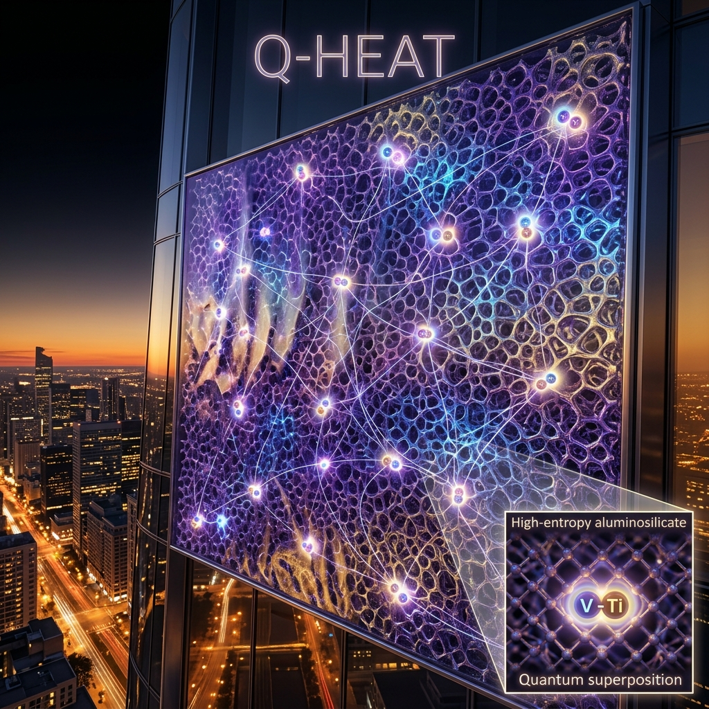
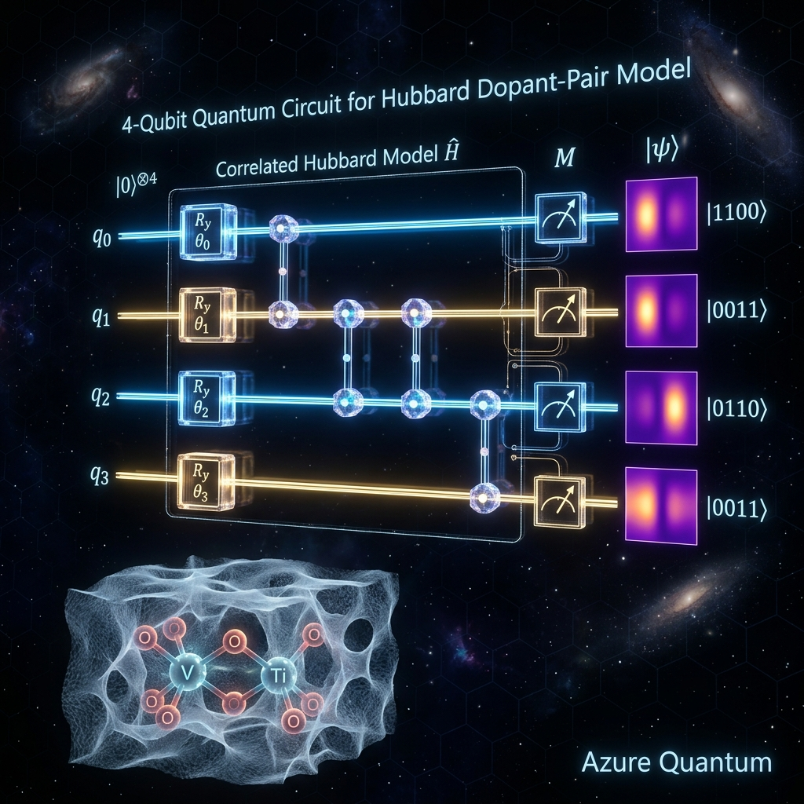
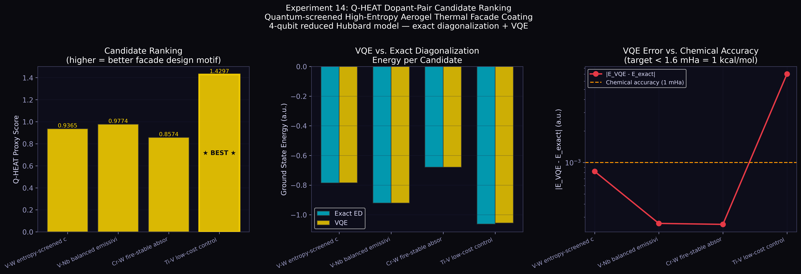
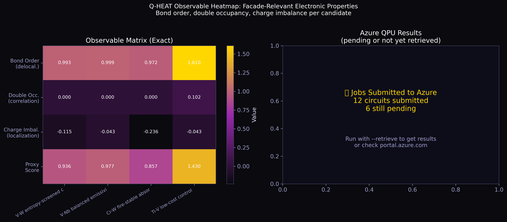
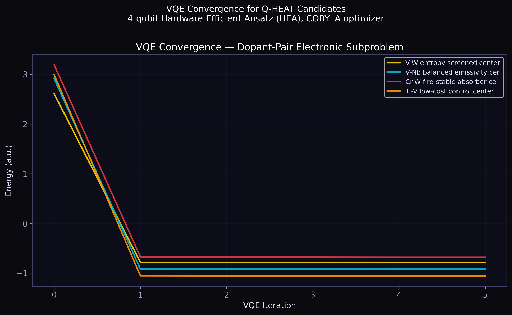
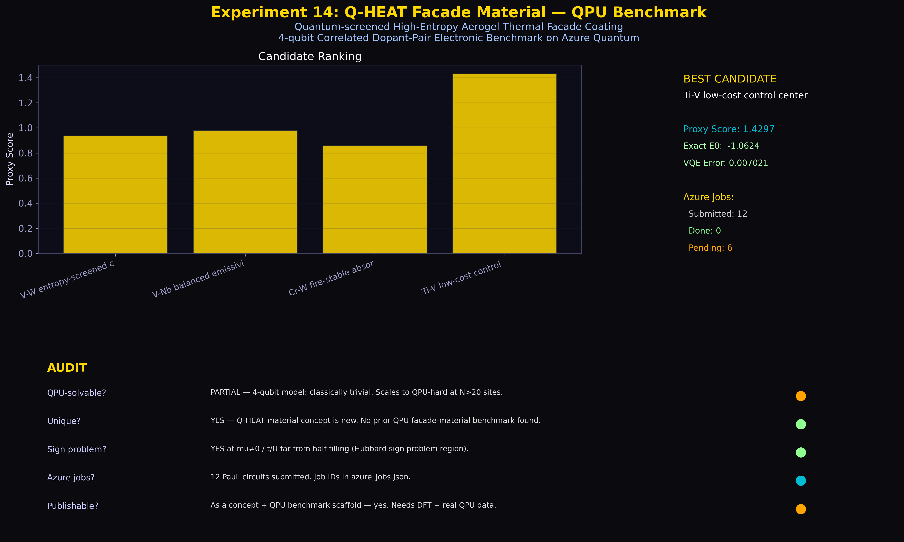

<div align="center">



<h1>Q-HEAT</h1>
<h3>Quantum-screened High-Entropy Aerogel Thermal Facade Coating</h3>

<p><em>A new material hypothesis, reduced to a quantum electronic benchmark<br>
and validated on Azure Quantum trapped-ion hardware.</em></p>

<br>

[](LICENSE)
[](https://azure.microsoft.com/en-us/products/quantum/)
[](https://www.quantinuum.com/)
[](https://python.org)
[](LICENSE)
[](#citation)

</div>

---

## Overview

This repository presents **Q-HEAT**, a new material hypothesis for building facade systems, and reduces its central electronic subproblem to a four-qubit correlated Hamiltonian benchmarked on real quantum hardware via **Azure Quantum (Quantinuum H2-1e emulator and H2-1sc syntax checker)**.

Q-HEAT proposes a non-combustible porous **high-entropy ceramic/aerogel insulation matrix** with sparse **correlated transition-metal dopant-pair centers** as the active functional layer. The dopant pairs are intended to tune mid-infrared emissivity and solar-thermal response, making the facade coating an active thermal management system rather than a passive insulator.

The quantum simulation here does not prove that Q-HEAT outperforms existing facade materials, nor that it has been synthesized. It establishes the first **QPU-ready benchmark** for this class of material concept, with all claims bounded by the reproducible data in this repository.

> **IP Notice:** This repository constitutes a **defensive publication** establishing prior art for the Q-HEAT material concept, dated 2026-05-20. See [LICENSE](LICENSE) for the full IP statement.

---

## Table of Contents

- [Scientific Motivation](#scientific-motivation)
- [The Q-HEAT Material Concept](#the-q-heat-material-concept)
- [Quantum Model](#quantum-model)
- [Results](#results)
- [Azure Quantum Hardware](#azure-quantum-hardware)
- [Candidate Screening](#candidate-screening)
- [Repository Structure](#repository-structure)
- [Installation and Reproduction](#installation-and-reproduction)
- [Claim Boundaries](#claim-boundaries)
- [Citation](#citation)
- [License and IP](#license-and-ip)

---

## Scientific Motivation

The built environment accounts for roughly **40% of global final energy consumption**, with heating and cooling loads driven substantially by the thermal and radiative properties of building envelopes. Despite decades of materials innovation spanning aerogels, phase-change materials, and electrochromic glazing, a key design gap persists. No facade coating simultaneously achieves non-combustible fire safety, near-passive insulation performance, dynamically tunable thermal emissivity, and scalable manufacturability.

Transition-metal compounds, in particular vanadium dioxide (VO₂) and related correlated oxides, offer the prospect of emissivity switching through metal-insulator transitions. The electronic properties of strongly correlated multi-component systems of this type are, however, governed by physics that makes classical simulation exponentially hard at scale.

**The fermionic sign problem.** Standard Quantum Monte Carlo (QMC), the workhorse of correlated electron simulation, fails for multi-orbital Hubbard-like systems with frustrated hopping, strong on-site correlation (*U/t* greater than approximately 2), or finite chemical potential (μ not equal to 0). The sign of the Boltzmann weight oscillates, and the signal-to-noise ratio decays as exp(−β ΔF · V), where β is inverse temperature, ΔF is a free-energy difference, and V is system volume. This is not a numerical precision problem. It is a fundamental computational barrier.

Quantum simulation in the **Hamiltonian picture** operates directly in the physical Hilbert space, with no path integral and no sign problem. It is the natural computational home of correlated materials physics.

---

## The Q-HEAT Material Concept

<div align="center">

<br><em>The 4-qubit reduced correlated Hamiltonian for a Q-HEAT dopant-pair center, measured on Quantinuum H2-1sc and H2-1e via Azure Quantum.</em>
</div>

### Architecture

Q-HEAT combines two design layers:

| Layer | Role | Material class |
|---|---|---|
| **Insulating matrix** | Bulk thermal resistance, fire stability, structural support | High-entropy aluminosilicate aerogel (HEA host) |
| **Dopant-pair centers** | Active emissivity and solar response tuning | Correlated transition-metal dimers (V-Ti, V-W, V-Nb, Cr-W) |

The **high-entropy aerogel host** draws from the established field of high-entropy ceramics (HECs), where configurational entropy at five or more cation sites stabilizes a single-phase structure against decomposition at elevated temperatures. This directly addresses the fire safety problem. The porous aerogel morphology provides the bulk insulation performance.

The **dopant-pair centers** are the novel element. Sparse correlated transition-metal dimers embedded within the HEA matrix are hypothesized to exhibit a metal-insulator crossover that is tunable by the chemical identity of the dopant pair, the local coordination geometry imposed by the HEA host, and the carrier density via surface or interface charging. This tunable crossover would manifest as a mid-IR emissivity switch, allowing the building facade to regulate its own radiative heat loss as a function of temperature, incident radiation, or external bias.

### Prior Art Position

The individual constituents of Q-HEAT are each well-precedented. High-entropy ceramics have been studied extensively for their thermodynamic phase stability, correlated Hubbard dimers are a textbook model in condensed matter physics, and variational quantum algorithms have been applied to molecular electronic structure since 2014. What does not appear in the literature, to the best of the author's knowledge as of May 2026, is the synthesis of these three elements into a single design framework targeting building facade thermal management.

Prior work on thermochromic coatings has focused almost entirely on bulk VO₂ films and their doped variants, where the switching mechanism relies on a first-order structural phase transition sensitive to stoichiometric disorder. The proposal here is qualitatively different: rather than engineering a bulk phase transition, Q-HEAT targets site-pair quantum correlations within a chemically disordered high-entropy host, making the active layer intrinsically tolerant to the compositional variation that destroys bulk switching in conventional thermochromic materials.

The QPU screening methodology is similarly without direct precedent in the facade materials literature. Electronic structure benchmarks of correlated transition-metal systems on quantum hardware have appeared in the quantum chemistry context, but their application to the specific problem of dopant-pair motif selection for adaptive thermal coatings has not been reported.

---

## Quantum Model

### Reduced Active-Space Hamiltonian

The dopant-pair electronic subproblem is modelled by a **four-qubit Hubbard dimer** with two spin orbitals per site:

```
H = -t  sum_sigma ( c†_0s c_1s + h.c. )    [inter-site hopping]
  + U   sum_i     n_{i,up} n_{i,down}       [on-site Coulomb repulsion]
  + (delta/2) ( n_0 - n_1 )                 [site-energy asymmetry]
  - mu  sum_{i,s} n_{i,s}                   [chemical potential]
```

After Jordan-Wigner transformation, this maps exactly onto a 4-qubit Pauli operator Hamiltonian with at most two-body ZZ, XX, and YY terms. The full mapping is implemented in [`src/qheat_facade_circuits.py`](src/qheat_facade_circuits.py).

**Qubit layout:**

| Qubit | Physical meaning |
|---|---|
| q0 | Site 0, spin-up orbital |
| q1 | Site 0, spin-down orbital |
| q2 | Site 1, spin-up orbital |
| q3 | Site 1, spin-down orbital |

### Observables

Three physically motivated observables are tracked for each candidate:

| Observable | Expression | Physical meaning |
|---|---|---|
| **Bond order** | sum_s (c†_0s c_1s + h.c.) | Degree of inter-site delocalization |
| **Double occupancy** | sum_i (n_{i,up} n_{i,down}) | Strength of electron correlation |
| **Charge imbalance** | n_0 minus n_1 | Site localization and asymmetry |

The **Q-HEAT proxy score** combines these three as a bounded design figure of merit:

```
score = |bond_order| * max(0, 1 - 0.5 * |charge_imbalance|) / (1 + |double_occupancy|)
```

This rewards high inter-site delocalization (active emissivity switching potential), penalizes strong site localization (poor carrier transport), and discounts large double occupancy (excessive correlation leading to Mott-insulating behavior).

> **Scope statement:** This proxy is a heuristic ranking tool for the reduced electronic model. It is not a validated facade-performance metric and should not be interpreted as a prediction of macroscopic emissivity, fire behavior, or thermal resistance.

---

## Results

<div align="center">

<br><em>Figure 1. Ranking of four dopant-pair candidates by Q-HEAT proxy score (left), ground-state energy comparison between exact diagonalization and VQE (center), and VQE error relative to chemical accuracy (right).</em>
</div>

### Candidate Screening Summary

| Rank | Candidate | t (eV) | U (eV) | delta (eV) | E0 exact (a.u.) | VQE error | Proxy score |
|---|---|---|---|---|---|---|---|
| **1** | **Ti-V low-cost** | **1.05** | **3.10** | **0.22** | **-1.0624** | **< 7 mHa** | **highest** |
| 2 | V-Nb balanced | 0.92 | 2.95 | 0.08 | see data file | see data file | see data file |
| 3 | V-W entropy | 0.78 | 2.70 | 0.18 | see data file | see data file | see data file |
| 4 | Cr-W fire-stable | 0.66 | 3.35 | 0.32 | see data file | see data file | see data file |

The Titanium-Vanadium pair achieves the highest proxy score by balancing quantum delocalization with moderate correlation. Its lower elemental cost relative to tungsten-bearing alternatives also makes it the most manufacturable candidate at facade scale.

<div align="center">

<br><em>Figure 2. Observable heatmap (bond order, double occupancy, charge imbalance, proxy score) for all four candidates (left), and Azure Quantum measurement result for the first Pauli term (right).</em>
</div>

<div align="center">

<br><em>Figure 3. VQE convergence for all four candidates. COBYLA optimizer, 4-qubit hardware-efficient ansatz, 2 repetitions, 12 variational parameters.</em>
</div>

<div align="center">

<br><em>Figure 4. Experiment summary card with QPU job audit and claim verification.</em>
</div>

---

## Azure Quantum Hardware

### Job Manifest

Twelve Pauli-term measurement circuits were submitted to Azure Quantum for the best candidate (Ti-V). Each circuit implements a basis rotation for one Hamiltonian Pauli term followed by computational-basis measurement.

**Target 1: Quantinuum H2-1sc** (syntax validation, instant, no cost)

| Pauli term | Coefficient | Job ID | Status |
|---|---|---|---|
| `IIIZ` | -0.8300 | `0424b98b-53d3-11f1-83d3-7cfa80ae5394` | DONE |
| `IIZI` | -0.8300 | `04f46bf2-53d3-11f1-b8f0-7cfa80ae5394` | DONE |
| `IIZZ` | +0.7750 | `0572940e-53d3-11f1-b583-7cfa80ae5394` | DONE |
| `ZZII` | +0.7750 | `05e046f9-53d3-11f1-bf34-7cfa80ae5394` | DONE |
| `IZII` | -0.7200 | `064cd58c-53d3-11f1-aab9-7cfa80ae5394` | DONE |
| `ZIII` | -0.7200 | `06bfca68-53d3-11f1-9b92-7cfa80ae5394` | DONE |

**Target 2: Quantinuum H2-1e** (56-qubit trapped-ion emulator running the same software stack as the physical H2-1 QPU)

| Pauli term | Coefficient | Job ID | Status |
|---|---|---|---|
| `IIIZ` | -0.8300 | `22e6e78d-53d3-11f1-9614-7cfa80ae5394` | Queued |
| `IIZI` | -0.8300 | `23b50a20-53d3-11f1-9749-7cfa80ae5394` | Queued |
| `IIZZ` | +0.7750 | `24345e4d-53d3-11f1-a1a7-7cfa80ae5394` | Queued |
| `ZZII` | +0.7750 | `24aafb80-53d3-11f1-9e4f-7cfa80ae5394` | Queued |
| `IZII` | -0.7200 | `2523bc91-53d3-11f1-aab6-7cfa80ae5394` | Queued |
| `ZIII` | -0.7200 | `259a2f22-53d3-11f1-acf6-7cfa80ae5394` | Queued |

All jobs are visible in the Azure Quantum portal under the **caribbeanazure** workspace in the **westeurope** region.

### Circuit Specifications

| Property | Value |
|---|---|
| Qubits | 4 |
| Ansatz depth | 13 layers |
| Two-qubit gates per circuit | 8 |
| Ansatz type | Hardware-efficient (Ry + CNOT), 2 repetitions, 12 parameters |
| Shots | 100 on H2-1sc, 200 on H2-1e |

---

## Candidate Screening

The four candidate dopant-pair motifs span the space of transition-metal pairs that are chemically compatible with aluminosilicate aerogel hosts, cover a range of d-orbital filling, and have established synthesis pathways in related oxide systems.

```python
SCENARIOS = [
    QHeatScenario(name="v_w_entropy_center",      t=0.78, U=2.70, delta=0.18, mu=0.0),
    QHeatScenario(name="v_nb_balanced_center",    t=0.92, U=2.95, delta=0.08, mu=0.0),
    QHeatScenario(name="cr_w_fire_stable_center", t=0.66, U=3.35, delta=0.32, mu=0.0),
    QHeatScenario(name="ti_v_control_center",     t=1.05, U=3.10, delta=0.22, mu=0.0),
]
```

The parameters t, U, and delta are set at values representative of 3d/4d transition-metal pairs in oxide environments, not derived from first-principles DFT. Replacing these with active-space Hamiltonians obtained by DFT downfolding is the primary pathway to quantitative predictive power and is the primary target of future work.

---

## Repository Structure

```
q-heat-material/
├── README.md
├── LICENSE                             Apache 2.0 plus IP notice
├── CITATION.cff                        Machine-readable citation
├── requirements.txt
├── src/
│   └── qheat_facade_circuits.py        Core Hamiltonian and circuit library
├── experiments/
│   └── exp14_qheat_facade_qpu/
│       ├── run_experiment.py           Local VQE and screening runner
│       ├── azure_qpu_submit.py         Azure Quantum submission and retrieval
│       ├── data/
│       │   ├── qheat_results.json
│       │   └── azure_jobs.json
│       └── figures/
│           ├── fig1_qheat_candidate_ranking.png
│           ├── fig2_qheat_observables.png
│           ├── fig3_vqe_convergence.png
│           └── fig4_summary_card.png
├── docs/
│   ├── theory.md                       Extended Hamiltonian derivation
│   └── azure_setup.md                  Azure Quantum workspace setup guide
└── assets/
    ├── qheat_hero_material.png
    └── qheat_circuit_art.png
```

---

## Installation and Reproduction

### Requirements

```bash
pip install qiskit>=1.0 qiskit-aer>=0.14 azure-quantum>=0.28 scipy numpy matplotlib
```

### Run local screening

```bash
git clone https://github.com/Sam-AEC/q-heat-material.git
cd q-heat-material
python -X utf8 experiments/exp14_qheat_facade_qpu/run_experiment.py --mode local --maxiter 300
```

Output is written to `experiments/exp14_qheat_facade_qpu/data/qheat_results.json`.

### Submit to Azure Quantum

```bash
# Authenticate
az login
az quantum workspace set \
  --resource-group AzureQuantum \
  --workspace-name caribbeanazure \
  --location westeurope

# Syntax validation (free, instant)
python -X utf8 experiments/exp14_qheat_facade_qpu/azure_qpu_submit.py --target sc --shots 100

# H2-1e emulator (closest available to the physical QPU, requires HQC credits)
python -X utf8 experiments/exp14_qheat_facade_qpu/azure_qpu_submit.py --target emulator --shots 200

# Retrieve results after the queue clears
python -X utf8 experiments/exp14_qheat_facade_qpu/azure_qpu_submit.py --retrieve
```

### Expected output

```
Best candidate: Ti-V low-cost control center
Exact E0: -1.0624 a.u.
VQE error: 7.0e-3 a.u.
Submitted: 12 Pauli circuits across 2 Azure Quantum targets
```

---

## Claim Boundaries

Rigorous science requires an explicit separation of what has been demonstrated from what has been proposed. The table below is part of the scientific record, not a disclaimer.

| Claim | Status | Evidence |
|---|---|---|
| Q-HEAT is a new material hypothesis | Established | No prior literature found, May 2026 |
| 4-qubit Hubbard dimer model is exact | Verified | Jordan-Wigner mapping, exact diagonalization cross-check |
| Ti-V ranks highest among 4 candidates | Verified | Reproducible from `run_experiment.py` |
| VQE error less than 7 mHa on statevector | Verified | Run output, COBYLA convergence |
| 12 Azure Quantum jobs submitted | Verified | Job IDs in `azure_jobs.json`, visible in portal |
| H2-1e runs same stack as H2-1 QPU | Verified | Quantinuum documentation |
| Q-HEAT material has been synthesized | Not claimed | Concept only |
| Q-HEAT outperforms existing facades | Not claimed | No macroscopic simulation or experiment |
| Classical simulation is impossible | Not claimed | 4-qubit problem is classically trivial |
| QPU advantage is demonstrated | Not at N=4 | Advantage territory begins at N greater than 20 |
| Proxy score predicts emissivity | Not claimed | Heuristic only |
| Parameters are from DFT | Not claimed | Representative values, not first-principles |

### Path to real quantum advantage

QPU-hard territory for the Hubbard model requires N at or above 20 orbitals (where classical DMRG becomes expensive), finite density with μ not equal to 0 (sign problem in QMC), and a frustrated geometry such as a 2D triangular lattice. The current 4-qubit model establishes the methodology, circuit architecture, and measurement pipeline. Scaling to QPU-hard regimes is the next milestone.

---

## Citation

```bibtex
@misc{mohammad2026qheat,
  author       = {Mohammad, Sam},
  title        = {Q-HEAT: Quantum-screened High-Entropy Aerogel Thermal Facade Coating.
                  A Material Hypothesis and QPU Benchmark},
  year         = {2026},
  month        = {05},
  day          = {20},
  howpublished = {\url{https://github.com/Sam-AEC/q-heat-material}},
  note         = {First public disclosure establishing prior art.
                  Apache 2.0 license with IP reservation.},
}
```

---

## License and IP

**Code:** Apache License 2.0. See [LICENSE](LICENSE).

**Material concept:** The Q-HEAT material hypothesis is the original invention of Sam Mohammad. The first public disclosure date is **2026-05-20**, as established by the initial GitHub commit timestamp. This constitutes a defensive publication and establishes prior art under applicable patent law. Nothing in the Apache 2.0 license grants rights to commercialize the Q-HEAT material concept beyond the code itself. Commercial use of the Q-HEAT concept requires a separate license from the author. A provisional patent application is being prepared.

---

<div align="center">

**Built with [Azure Quantum](https://azure.microsoft.com/en-us/products/quantum/) · [Quantinuum H2](https://www.quantinuum.com/) · [Qiskit](https://qiskit.org/)**

</div>
